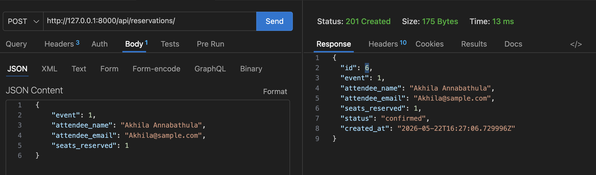
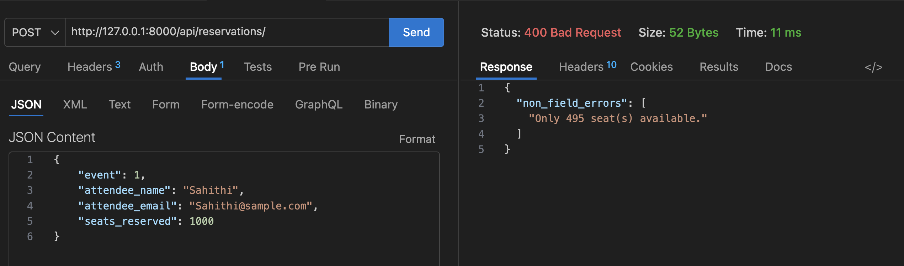
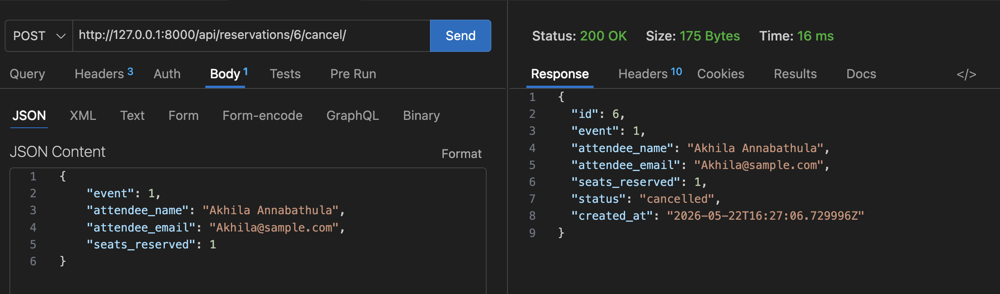

A RESTful API for an event ticketing platform built with Django and Django REST Framework.

steps to process : 
step1 : Create and activate virtual environment
python3 -m venv venv
source venv/bin/activate  

step2: Install dependencies
pip install django djangorestframework

step3 : Run database migrations
python3 manage.py makemigrations
python3 manage.py migrate

step4 : Start the development server
python3 manage.py runserver

Access the API :
I installed Thunder client in VS code , 
Base URL: http://127.0.0.1:8000/api/

API Endpoints : 
Reservation Endpoints
Method	Endpoint	Description	Example
GET	/api/reservations/	List all reservations	http://127.0.0.1:8000/api/reservations/
GET	/api/reservations/?event_id=1	Filter reservations by event	Get reservations for event #1
POST	/api/reservations/	Create a new reservation	Books seats and deducts from available
POST	/api/reservations/{id}/cancel/	Cancel a reservation	Restores seats to the event

Design Decision : Why seat deduction happens in the serializer's create() method .

Decision: I chose to implement seat availability management inside the ReservationSerializer.create() method rather than in the view.

Reasoning:
This keeps validation and creation together in one place, preventing race conditions and maintaining clean code architecture.

## Screenshots

### 1. Successful Reservation (201 Created)

### 2. Overbooking Failure (400 Bad Request)

### 3. Successful Cancellation (200 OK)

